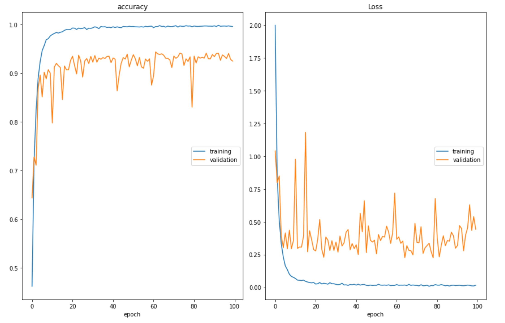

# CNN-Music-Genres-Classification
* **Neural Networks course project**

   The Neural Networks course project on music genres classification task with Convolutional Neural Networks (CNNs)

* **Clone this repo**

  ```shell
  git clone https://github.com/kamyabazizi/CNN-Music-Genres-Classification.git
  cd CNN-Music-Genres-Classification
  ```

* **Installation**
  
  Install the livelossplot:
  ```shell
  pip install livelossplot
  ```

* **Dataset**

  Before running train.py, download and keep the training and test data in folds from the below google drive links:
  
  - **Training data:**
  
    https://drive.google.com/file/d/1E9BBIPWadHhcEYAq_t2jrmZrMmyODyjd/view?usp=sharing

    https://drive.google.com/file/d/1-75xNU0Bwsk4AEibswywkY6HlvDSkhnP/view?usp=sharing
  
  - **Test data:**
  
    https://drive.google.com/file/d/1-5PHlDQSIW6wsm8f5vvxyaOFLmZ5jfp5/view?usp=sharing
  
    https://drive.google.com/file/d/1-5PHlDQSIW6wsm8f5vvxyaOFLmZ5jfp5/view?usp=sharing
  
* **Taining**

  Start training:
  ```shell
  python train.py
  ```
  Output:
 
 <p align="center">
  
 </p>

* **Test**
   
   Test accuracy:
   ```shell
   python test.py
   ```
   
   Output:
   
   **Test loss: 2.433227300643921**
   
   **Test accuracy: 0.8099055290222168**
