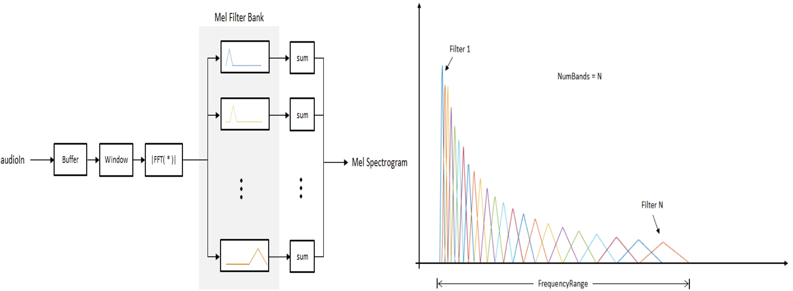

# Download the dataset

Before running train.py, download and keep the training data in this folder from the below google drive links:

  **Training data:**
  
  https://drive.google.com/file/d/1E9BBIPWadHhcEYAq_t2jrmZrMmyODyjd/view?usp=sharing

  https://drive.google.com/file/d/1-75xNU0Bwsk4AEibswywkY6HlvDSkhnP/view?usp=sharing
  
  **Test data:**
  
  https://drive.google.com/file/d/1-5PHlDQSIW6wsm8f5vvxyaOFLmZ5jfp5/view?usp=sharing
  
  https://drive.google.com/file/d/1-5PHlDQSIW6wsm8f5vvxyaOFLmZ5jfp5/view?usp=sharing
  
This folder contains the preprocessed data from the GTZAN Dataset with 10 different classes of music genres.

The gtzan8 audio dataset contains 1000 tracks of 30 second length. There are 10 genres, each containing 100 tracks which are all 22050Hz Mono 16-bit audio files in .wav format. The genres are:

 * blues

 * classical

 * country

 * disco

 * hiphop

 * jazz

 * metal

 * pop 

 * reggae

 * rock

 # Preprocessing

  This folder contains the preprocessed data by taking the Mel-frequency spectrogram of audio and saving them in .npy files.
  
  **Mel-frequency spectrogram:**
  
   

    
   

